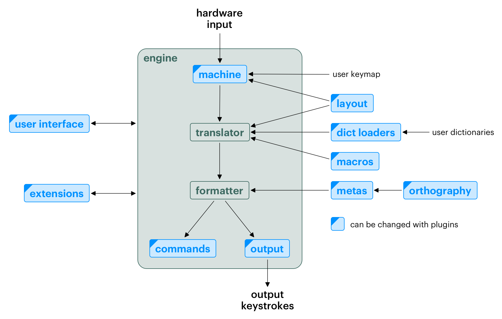

# Top-Level Design

The Plover application has two main components: the engine, which captures
keystroke data from the hardware and translates it into keystrokes
corresponding to the output text; and the user interface, which provides a way
to configure translation and other parts of the engine.

## Engine

The translation process that occurs in the engine is composed of four major
phases: _capture_, _translation_, _formatting_, and _rendering_. Each phase is
controlled by a separate component; the engine connects all of their
outputs according to the program's configuration.

```{figure-md} engine-flow


A diagram of the components involved in translating steno keystrokes to text
in the Plover engine.
```

### Capture

The first phase is **capturing** user input, in the form of either keystrokes
on a standard keyboard or steno stroke data from a steno writer. The exact
method of communication between Plover and the device depends on the hardware.

Capture is performed by a **machine plugin**. Some are already included with
Plover, but others may require installing third-party plugins. Plover has
support for two primary types of protocols:

- **Keyboard**: captures input from a standard computer keyboard, using the USB
  Human Interface Device (HID) protocol.

  Keyboard capture uses operating system APIs to capture keystrokes. As a
  result, the exact implementations will be specific to each platform, and only
  a handful of platforms are supported at this time.

- **Serial**: captures input from steno writers, both hobbyist and professional,
  using UART over a USB connection. Most professional writers will support this
  protocol, and Plover provides native support for most steno protocols.

See [Keyboard Capture & Output](keyboard-capture-output) for more details on
these protocols, and how to implement capture for your protocol or platform.

Once the keystrokes have been captured, the engine is then responsible for
translating _physical_ keys in keystrokes to _logical_ steno keys based on
the active [system](api/system), then sending them to the translator.

### Translation

The **translator** is the second phase of the engine. It receives captured
steno strokes and looks up translations against the user's dictionaries.

The translator has a _buffer_ of previously entered strokes (100 strokes by
default); this allows for multi-stroke outlines to be translated properly,
and for the latest strokes to be undone when the user presses `*` (or whatever
outline translates to the undo macro).

#### Dictionaries

A **dictionary** is a collection of entries which map steno outlines to
translations. Each outline consists of one or more strokes; the translations
may be either a singular _macro_, which is executed by the translator,
or a sequence of formatting operators, which is passed to the formatter.

The user's active system should have a configured _dictionary stack_, which is
a list of dictionaries in descending priority. During the lookup process,
the translator searches the topmost (highest-priority) dictionary for the steno
outline, stopping when it finds an entry; then the next dictionary down the
stack, and so on.

To account for multi-stroke outlines, the translator searches the dictionary
stack for the longest possible series of strokes first, then one less stroke,
and so on until the last stroke. The longest possible series of strokes is
determined by the length of the longest entry across all dictionaries in the
stack.

If an entry is not found, it results in an _untranslate_ or _untran_, which
indicates that there is no matching outline. This signals to the user that
the steno may have been written incorrectly, or that a dictionary entry needs
to be added.

Some CAT systems support conflicts between multiple entries with the same
steno but differing translations. Plover _does not_ support this; each outline
may only have exactly one translation, and entries farther up the dictionary
stack will override, rather than augment, entries lower in the stack.

#### Dictionary Loaders

Dictionaries are loaded at startup time, based on the order specified in the
user configuration. The [format of the dictionary](dict_formats) is determined
by the file extension; for example, `main.json` is detected to be a JSON file,
or `main.rtf` a RTF/CRE file.

Dictionary loaders must follow these requirements:

- Outlines must map to exactly one translation (i.e. no randomness or conflicts),
  expressed in Plover's [translation language](translation_language);
- Steno notation in outlines must be valid for the selected system;
- The translation must contain either exactly one macro or a sequence of
  non-macro actions;
- The length of the longest key must be known and fixed.

#### Macros

A **macro** is a special action performed by the translator which may modify
the stroke buffer, for example to modify or remove the most recent outline.

Some examples built into Plover include:

- `=undo`, which removes the most recently entered stroke;
- `=retro_toggle_asterisk`, which adds a `*` key to the most recently entered stroke.

The {class}`Translator<plover.translation.Translator>` class provides an API
for modifying the translation buffer, including adding or undoing individual
strokes.

### Formatting

The **formatter** is the third phase of the engine. It receives individual
outline translations from the translator, and converts it into a series of
_actions_. Formatting actions consist of:

- **output instructions**, such as text strings, backspaces, or keyboard
  combinations; and

- **state changes**, such as capitalization, or adding or omitting spaces
  between words.

We can think of an action as just a set of changes to get from one state of
the output text buffer to another; the changes can then be undone if needed.

The most basic type of action is inserting text; for example, `foo` is an
action that simply inserts the letters `f`, `o`, and `o`. Actions may also
contain some metadata, such as whether the word immediately after should be
capitalized, or whether a space should be inserted.

#### Metas

A **meta** is a special formatting operator which may do any of the following:

- modify the output instructions, such as outputting some text dynamically, or
  changing the spelling of a word when a suffix is added;
- change the internal formatting state, such as removing a space before the
  next word;
- add some metadata to an action, which may be used to influence how later
  translations are formatted.

Metas may either modify a previously translated action, for example
capitalizing the previous word, or create a new action.

Some of the built-in metas work with the system's _orthography_, which is the
set of rules to change the spelling of words when suffixes are added.

### Rendering

The final phase, **rendering**, executes the actions produced by the formatter.
Actions may be either _commands_, which run on the engine itself, and _output_,
which sends keystrokes to the operating system.

#### Commands

Engine commands perform actions on the engine itself, such as disabling or
enabling translation and output, or opening various Plover tools. In addition
to the built-in Plover commands, engine commands may be provided by plugins.

Most commands will not be executed when translation is disabled; the only
exception is `{plover:resume}`, which restarts the Plover engine.

#### Output

Three types of output can be rendered:

- inserting text, by sending keystrokes through the operating system;
- deleting text, by sending the Backspace key; and
- executing arbitrary [key combinations](key_combo).

The renderer calculates the minimum possible sequence of output steps to
produce the necessary changes; for example, to change `cat` to `catalog`,
rather than deleting three characters and inserting seven, the renderer only
needs to insert four.

Insertions and deletions may be undone if the undo macro is executed;
key combinations, however, can not be undone, because many key combinations do
not have a neat inverse.

### Hooks

The engine communicates with other components, including the user interface
and some plugins, using _hooks_.

Plugins may connect to a hook by calling {meth}`StenoEngine.hook_connect<plover.engine.StenoEngine.hook_connect>`
and providing a callback function:

```python
class MyExtension:
  def __init__(self, engine: plover.engine.StenoEngine):
    self.engine = engine

  def start(self):
    # Connect to the "stroked" hook
    self.engine.hook_connect("stroked", self._on_stroked)

  def _on_stroked(self, stroke: plover.steno.Stroke):
    ...  # Gets called after each stroke
```

Events that occur within the Plover engine, such as machine disconnections,
stroke inputs, and configuration changes, trigger these hooks, which in turn
call the callback functions.

[Engine Hooks](engine-hooks) provides the full list of available hooks.

## User Interface

```{todo}
Complete this section.
```
