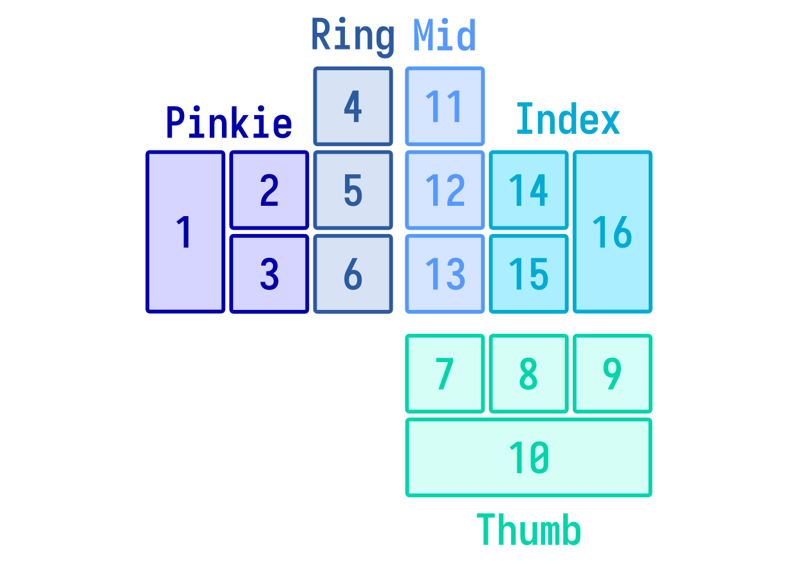

# Picking a board layout

Before designing the specific layout for your system, you'll have to select the shape of your layout and the types of keys that will be on the layout. You can either use an existing board shape, or you may choose to design a new one based on the system specifications. 

## Using an existing board layout

- **English Stenotype Board**: 7 keys on the left bank, 10 keys on the right bank, 2 shared keys (the number key and the asterisk key), and 2 thumb keys for each hand. This board layout gives more keys to the right hand since English syllables typically have longer ending consonant clusters (such as `-ftd`), resulting in the right pinkie doing extra work. If you're designing a system for a language that's written right-to-left, then you may also consider using a flipped version of this layout.

- **English Stenotype Board with Split S**: A hugely popular board layout that splits the left S key into two keys, giving us 8 keys on the left bank. This is helpful if you think that the 7 keys in the original layout is not enough. 

- **Qwerty Board**: A traditional keyboard, typically staggered horizontally (keys are offset sideways), though sometimes orthogonal boards are also used. This is great for users who only have traditional keyboards, though thumb keys are limited in their quantity or comfort.

- **Palantype/Velotype**: These board layouts have much more keys than traditional layouts, providing far more combinations for your system. They can be very hard to find suitable hardware for, and for systems such as the velotype, it can be hard to find a good mapping for your system onto a traditional keyboard due to the excessive number of rows. 

- **Other Existing Board Layouts**: You can find a list of layouts in [this list of steno layouts](https://github.com/openstenoproject/plover/wiki/Steno-Layouts-&-Supported-Languages).

## Things to consider

- **Chording Comfort**: It is important for your layout to be comfortable to use at high speeds. For simple layouts such as the Japanese StenoWord (one row layout), it is possible to reach speeds of 5 to 6 chords per second, but expect speeds of about 3 to 4 chords for second for most chorded boards. Consider how easy it is to switch between different positions on the board, and how many keys each finger is responsible for pressing, especially weaker fingers like your pinkies and ring fingers.

- **Impossible Chords**: If you assign more than 2 keys to a finger, there is a chance that there are combinations of keys under a single finger that are impossible to chord. For instance, in the English layout, the right pinkie is unable to stroke the combination `TZ` alone, and a technique known as the Philly Shift (involving moving the ring finger to the right) is required to stroke the combination. This problem is commonly seen in board layouts that have 4 keys assigned to a single finger, or 3 keys in a single column. 

- **Wrist Keys/Foot Pedals**: Some layouts include additional keys that are pressed not by your fingers, but by your wrists or your feet. You may consider these, but take note of the additional coordination required.

- **Hobbyist Board Compatibility**: Consider whether the board layout you choose will be compatible with existing hobbyist boards. Many existing hobbyist boards only have two rows of keys, and some boards only have 2 thumb keys on each hand, which might restrict the number the keys you can include in your custom layout. 

- **Traditional Keyboard Compatibility**: Consider whether the board layout you choose will be compatible with traditional Qwerty keyboards. The English stenotype system is compatible, but an additional row would be problemmatic due to the awkward horizontal stagger on most keyboards - notice how the number row on most keyboards are offset by the width of half a key, which makes chording them difficult. 

- **Single-handed Layouts**: It is possible to create systems that use single-handed layouts; many of these systems would have to assign more keys to each finger in order to make up for the reduced number of fingers used in chording. Be careful in the design to avoid layouts that force your fingers to shift to awkward or impossible positions. 

## Example

In our one-handed English steno example, we'll be picking this board layout:

Since we're working with just one hand, we've picked a one-handed layout that assigns as many keys as possible to all the fingers without making the board too uncomfortable to use. None of the existing layouts were designed for one-handed use, so we had to design our own. Here are some of the things we considered:

- **Chording Comfort**: We've assigned a maximum of 4 keys to each finger to make sure that there won't be too many awkward chords that we'll have to use. 

- **Hardware Compatibility**: Since hobbyist keyboard compatibility is not a priority here (they're all designed for double-handed layouts), we have the freedom to design something that suits our goals better. Since the bottom most row in most traditional keyboards are taken up by a large spacebar, we've decided to make the bottom most row a long bar so that it can be mapped to the spacebar. 
