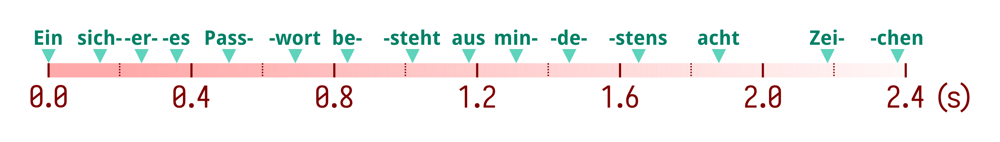
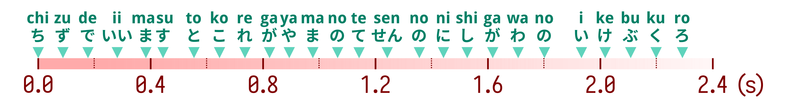
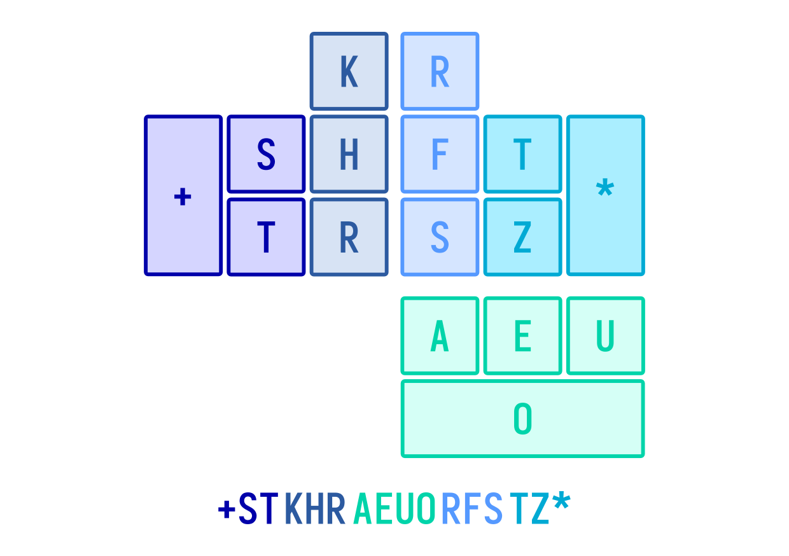

# Arranging the Keys

After deciding on a board layout, the next step is to decide which keys will go in which positions on your board. Feel free to edit the board layout in this step, especially if you think that the board that you have chosen has too many or too few keys.

Much like the board layout, you may choose to use an existing key layout as well for your system. The English stenotype layout is fairly versatile and has been used in many European languages as well. A good place to start is a steno layout of a related language. 

## Syllables/Words per Chord

Depending on the average speed at which your language is spoken at, you will have to consider how many syllables or words you will have to fit into each chord for the system to be realtime capable (if that is one of your goals). Some languages are naturally faster than others, and thus will require more tightly-packed chords.

Take, for instance, the German sentence *"Ein sicheres Passwort besteht aus mindestens acht Zeichen"*. This sentence contains 15 syllables, and can be spoken within 2.4 seconds: 

If we were to give every syllable its own chord, that would require us to stroke **6.25 chords per second** - far higher than the usual 3.5 to 4 chords per second speeds achieved by professionals. If, instead, we choose to give every word its own chord, that would give us **3.33 chords per second**, which is far more manageable. 

In this case, we would ideally want to encode on average one word per stroke - while it would still require us to stroke at extremely fast speeds, pauses between sentences will give us ample time to catch up. Here is a German layout - it is similar to the English layout, where each chord is able to stroke one syllable, but it is also capable of writing multisyllable words in single strokes:

A rather extreme example would be Japanese, which is spoken at a much higher speed than German. Take for example the partial sentence *"地図で言いますとこれが山手線の西側の池袋"*. It contains 26 syllables and can be spoken in 2.4 seconds:

Using a single chord for each syllable gives us **10.83 chords per second**, which is unrealistic. Instead, we might consider a system that can encode up to 3 syllables per stroke, which would then give us a slower stroke speed of **3.61 chords per second**. The Sokutaipu layout has a semi-symmetrical layout where both the left and right bank can input a syllable, and the thumb cluster can input an additional syllable: 

## Steno Order

Before deciding on the exact key positions, note that you are not forced to make the steno order in your layout left-to-right. Depending on the type of system and the language you're making the system for, you may choose to use a different steno order:

- **Right-to-left**: Suitable for languages that are written from right to left, such as Arabic or Farsi.
- **Symmetric out-to-in**: For symmetric layouts that go from left-to-right on the left hand and a reflected order on the right hand. This order allows the two sides to be fully mirrored, such as the left and right banks in the Japanese Sokutaipu system as shown in the previous section.
- **Symmetric in-to-out**: For symmetric layouts that go from left-to-right on the right hand such that the left hand can be mirrored. The Mandarin Yawei system uses this order: 

## Vowel Keys

Since most layouts have fewer vowel keys and more consonant keys, you may choose to arrange them first, before the consonants. Vowel keys typically appear in the middle of the board, assigned to the thumbs; here are the things you might want to consider when picking the vowel key arrangement:

- **Number of vowel sounds in your languages.** This includes diphthongs and triphthongs where applicable - your language may include very few vowels, such as Japanese, which only has 5, or it might contain a lot of vowels, such as English, which depending on dialect may include more than 20. 
- **Common Semi-vowels.** Semi-vowels include the Y and W sounds. You may choose to add them to your vowel keys if they are commonly grouped with vowels. This isn't done in the English layout, but the keys/chords for these sounds are still placed relatively close to the vowel cluster. 
- **Ending vowels.** If your language contains a lot of words that end with vowels, such as Italian, you may choose to add an additional vowel key cluster at the end of the chord. An ending vowel key might also be useful for languages that have a significant number of words with ending vowels even if it isn't terribly common. Take a look at the Melani system, which accounts for the fact that Italian words commonly end with vowels: 

## Consonant Clusters

To determine which consonant keys will go on the layout and in what order they are in, you will have to do frequency and n-gram analysis of a sizable amount of text in your language. There are a few things that you should try to determine:

- **What the most common consonants are.** This will affect what consonants will ultimately appear on your layout, and which consonants will be assigned multikey chords instead.
- **How often each consonant appears before or after another consonant.** This will affect the order of the consonants on the layout. For example, at the start of words or syllables in English, the S sound typically appears before the T sound (such as in words like "straight", "start", "star"). This means that we should place the S key/chord before the T key/chord in the layout.
- **How often each consonant appears with another consonant.** This will also affect the order of the consonants on the layout - you'd want consonants that commonly appear together to not overlap in the layout such that they can be stroked in combination with each other. For instance, the S and N sounds in English appear together in a lot of words (such as "snake", "snail" etc.), hence the English layout allows us to stroke the two sounds with two non-overlapping chords.

## Disambiguation/Number Keys

Many layouts include additional non-phonetic/orthographic keys to distinguish between words that have similar pronunciations or would otherwise be stroked the same way without some method of telling them apart. In the English layout, this is the asterisk key at the center of the board. Other possible uses of these keys might be:

- Writing additional sounds (for instance, `S*` could represent the Z sound)
- Switching between different writing systems
- Inputting numbers, much like the number bar in the English layout 

The Palantype layout takes this to an extreme with 3 special keys (`*`, `^`, `+`):

## Additional Things to Consider

- **Compound Words/Agglunitative/Synthetic Languages**: For languages such as German, or agglunitative/synthetic languages such as Turkish or Finnish, which include a lot of long words, you may consider adding an additional "No Space" key. There are also solutions that don't require such a key, using a system of prefixes and suffixes, or a "No Space" chord.

- **Tone Keys**: If you're designing a system for a tonal language and you choose to include the tone in the layout, you may determine the number of keys required to represent every tone and assign each tone to a chord. There are many options for where to place the tone keys as well, with a common place being right after the vowels, such as the `FJZ` keys in the Vietnamese layout:

## Example

In our one-handed English steno example, we've chosen this layout: 

**Syllables per Chord**: Since speed isn't the priority, we've chosen to make each stroke represent 1 syllable, with an initial consonant (pinkie & ring), a vowel (thumb), and a final consonant. (middle & index)

**Steno Order**: To reflect the initial-vowel-final order of English syllables, we've chosen to order the keys from the left side to the thumb, then to the right side. The thumb has been given the vowel keys since it is the most flexible out of all the fingers, which allows us to allocate as many keys as we might possibly need to it.

**Vowel Keys**: We've chosen 4 vowel keys to represent most English vowels; much like the traditional English layout, individual keys will represent short vowels spelled with those keys, while long vowels will be represented with chords, like so:

    AE  : AY in "pay", AI in "pair"
     EU : I in "pin"
    A  O: AW in "paw"
     E O: EE in "peel"
      UO: OO in "pool"
    AE O: OU in "pout"
     EUO: OE in "poe"

**Consonant Keys**: We've picked the most common consonants on each side, using a similar order to the original English stenotype layout. We'll use these combinations for the missing sounds:

    +S    : Initial Z-
    + T   : Initial D-
    +  K  : Initial G-
    +   H : Initial B-
    +    R: Initial L-
     S  H : Initial SH-
      T H : Initial TH-
       KH : Initial CH-
      TK  : Initial N-
    + TK  : Initial M-
        HR: Initial P-
    +   HR: Initial J-
    +S  H : Initial Y-
    + T H : Initial W-

    R    *: Final -L
     F   *: Final -V
      S  *: Final -SH
       T *: Final -D
        Z*: Final -ZH/-J
    RF    : Final -P
    RF   *: Final -B
     FS   : Final -N
     FS  *: Final -M
      ST *: Final -CH
       TZ : Final -K
       TZ*: Final -G
     F T *: Final -TH
      S Z*: Final -NG
