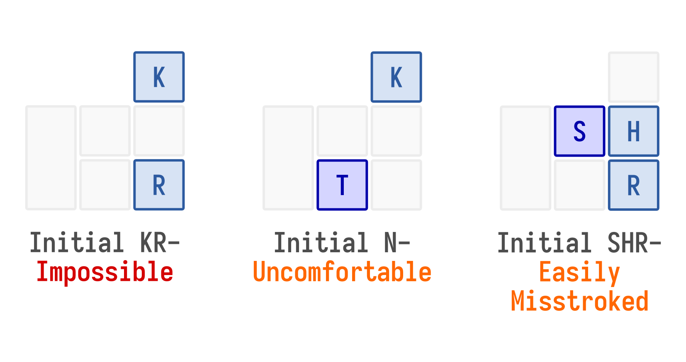

# Testing the Layout

```{note}
This section uses a one-handed English steno layout as an example; this layout was introduced in the [previous section on key arrangements](key-arrangement).
```

The test way to perfect your layout is to repeatedly test your layout while constructing your theory, spotting mistakes in each test and iteratively improving the layout until you get a satisfactory result. Here are some tests that you can do: 

## Sample Text Test

Take a sample text from your language and try to figure out what chords you'll use to write that text. You may try to include a mix of long and short words, common and uncommon words to test the speed of the layout.

In our one-handed English steno example, consider the test below:

      T H  EU   S       This
           EU   S       is
          AE            a
      T    E    ST      test
             O F        of
      T H  E            the
    + T H   U  FS       one
        H      F        - (hyphen)
        H A    FST      hand
                 T *       -ed
    +    RAE            lay
          AE O   T        -out
      T H A      T      that
    + T H  E            we
        H A    F   *    have
       K R E O          cre
          AE     T        -ate
                 T *         -d
        K     R         . (period)
           EU    T      It
           EU   S       is
          AE            a
      T    E  R         ter
         R EU             -ri
    +   H     R    *        -ble
    +    RAE            lay
          AE O   T        -out
        K     R         . (period)

While you are testing your layout, take note of these common pitfalls:

- **Short words that take too many strokes to write**: In this example, notice how it took us two strokes to write the simple word "create". Perhaps we could introduce new rules to the theory that allow us to write it in one stroke.

- **Common words that take too many keys to stroke**: Ideally, you'd want very common words in your language, especially grammatical particles/words such as "the" or "is" to be written with strokes that have fewer keys. In our example, words such as "it" or "this" can require up to 3 or 4 keys to write - perhaps we can abbreviate them.

- **Unexpected consonant clusters**: Sometimes, you might encounter a consonant structure that you failed to account for in your original layout draft or rule set. In this case, the -ND final consonant cluster wasn't accounted for, and we're forced to use the awkward stroke `FST` to input the word "hand". 

- **Low briefing potential**: Briefing, or steno abbreviations, are great for increasing your input speed. There are two kinds of briefs: word briefs and phrase briefs. Take note of instances where you'd like to squeeze multisyllable words into a layout that can otherwise only do single syllables, or instances where you'd like to squeeze multiple words into a single stroke (especially common phrases like "in the") - it would be problematic if one of your goals is to achieve high speeds and you're unable to devise a method of creating briefs for these words or phrases effectively on your layout. 


## Disambiguation Test

To push your layout to the extreme, do a test on a group of words that are similar in spelling or pronunciation. Here are a few tests that you may consider:

- **Words that share the same initial and final consonants**, such as "bat", "bit", "bot", "beet", "beat" etc.
- **Words that share similar pronunciations**, such as "sees", "cease", "seize", "seas" etc.
- **Potential word boundary issues**, such as "buttock pie" versus "but occupy" etc. 

Here's the B\*T test run on our one-handed layout:

    +   H A      T      bat
    +   H  E     T      bet
    +   H  EU    T      bit
    +   H    O   T      bot
    +   H   U    T      but
    +   H   U    T   ⌉  butt
                 T   ⌋
    +   H  E O   T      beet
    +   H  E         ⌉  beat
          A      T   ⌋
    +   H AE O   T      bout
    +   H   UO   T      boot
    +   H AE     T      bait
    +   H A  O   T      bought

Immediately, we see that we're forced to write some one-syllable words with two strokes, which is not ideal. Take note of these common mistakes:

- **Memorization-based disambiguation**: When similar words are assigned arbitrarily to different strokes without any rules and users are required to memorize them. It is generally not ideal to increase the memory load required to learn your system.
- **Inconsistent disambiguation rules**: When you have to make exceptions to fit certain words or phrases in your system - these inconsistencies can make your system difficult and frustrating to use.
- **Insufficient keys/Too many keys**: After stress-testing your system, you may realize that your system contains insufficient keys, or that you have way more keys than what is necessary for disambiguation. 


## Comfort Test

It is also important to test how comfortable your system will be when you're using it. Take a look at the rules that you have defined and the strokes that you may have assigned to various words, and look out for these:

- **Impossible strokes**: Strokes that require you to bend/stretch your fingers in ways that are not humanly possible. 
- **Uncomfortable strokes**: Strokes that are possible but extremely uncomfortable.
- **Easily misstroked**: Strokes that can be very easily misstroked.

Here are some examples from our one-handed layout:



The best way to carry this out is to test it on actual hardware - try the strokes on your actual hardware and judge for yourself whether it's uncomfortable. 
